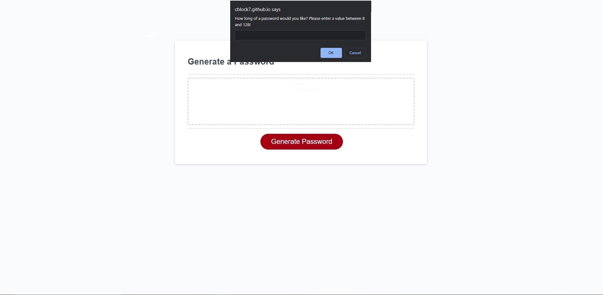

# 03 JavaScript: Password Generator

This web application is designed to gather user input via prompt windows and generate a random password based on the criteria inputed by the user. This was our first attempt at using JavaScript to accomplish a task. 

